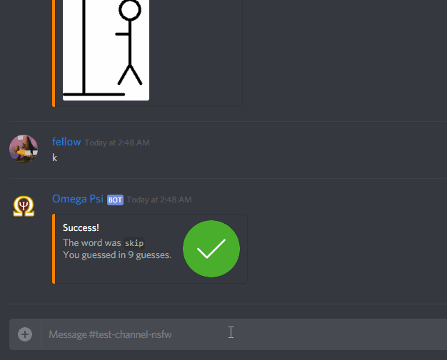
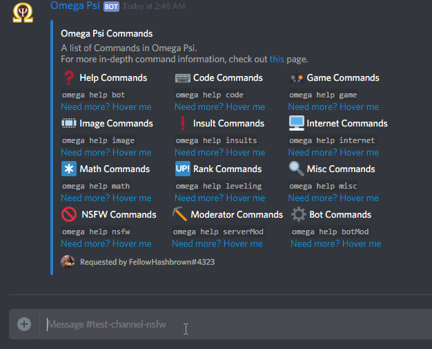
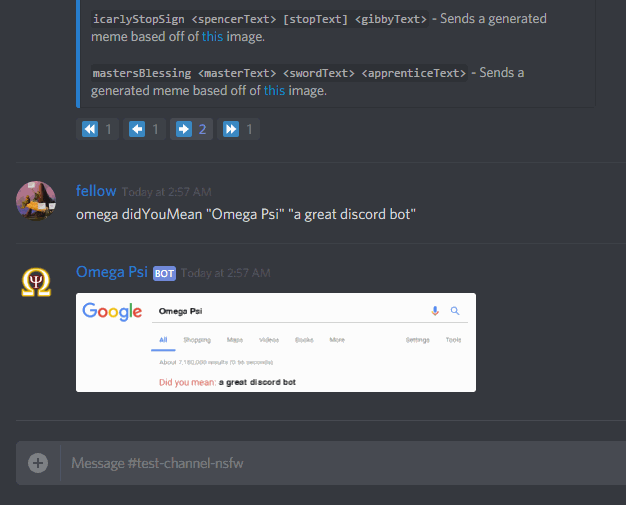
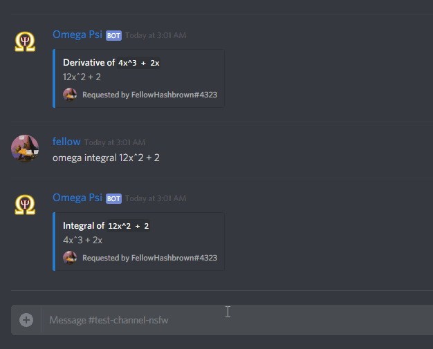
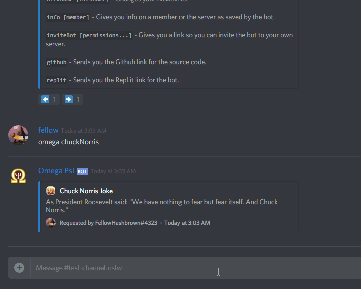

Support Server: 

# Omega Psi
A Discord Bot, constantly being developed, that includes all sorts of commands from minigames to server moderation.

Prefix: `omega `
  * You can add multiple prefixes to your server. The default one cannot be removed.

## Highlights
There are all sorts of things being added almost everyday.
Each category is labeled properly and includes commands tailored to that category.
  * Code
    * Base Conversion
    * [Brainfuck](https://en.wikipedia.org/wiki/Brainfuck) interpreter
  * Game
    * Connect Four
    * Hangman
    * Online Game Stats for Black Ops 3/4, Fortnite, and League of Legends
  * Image
    * Meme Generators! At least two new meme generators come out per week. (Sidenote: You can also supply an image URL and an image will be placed instead of text)
    * Gifs
    * NASA Images
    * Avatars
  * Math
    * Basic commands as of right now including simplification, derivatives, and even the fibonacci sequence
    * Physics commands! Right now, there is only linear kinematics. But soon there will be more physics commands.
  * Internet
    * Anything you can find on the internet, you can find here
    * IMDb
    * Translations between 95 different languages
  * Miscellaneous
    * Things that just don't quite fit into anything
    * Change your nickname (Sidenote: If you are a higher role than the bot in a server, your nickname cannot be changed)
    * Chuck Norris jokes
    * Find out what a color is from either HEX, HSL, RGB, or CMYK
  * NSFW
    * Naughty commands (18+)
    * Can only be run in an NSFW channel (It just makes sense)
    * Urban Dictionary

## Some Examples of Commands

**Base Conversion**

**Hangman**

**Meme Generator**

**Derivative and Integral**

**Translation**

**Chuck Norris**

**IMDb**

## Add to Server
If you don't already have Omega Psi in your server, [here](https://discordapp.com/oauth2/authorize?scope=bot&client_id=503804826187071501&permissions=0) is a basic link (no permissions) you can use.
If you want a custom permission integer, you can use the `omega invite` command to do that. You can customize all aspects of the bot's control. (Just try it out)
